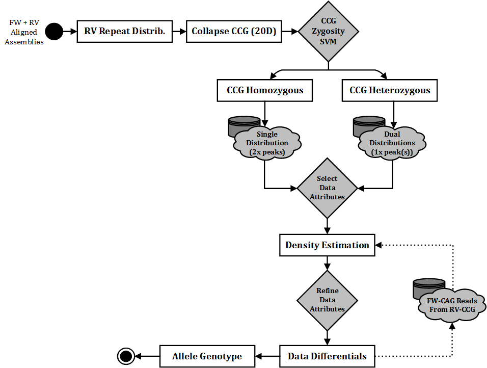

.. _sect_alignment:

Sequence Alignment (SeqAlign)
================================

Next, is the sequence alignment stage. We utilise the Burrows-Wheeler Aligner (http://bio-bwa.sourceforge.net/) to carry out alignment of our sequences to a reference library. Our reference library structure of 4000 varying CAG/CCG references can be read about in :ref:`sect_dataassume`. Sample reference libraries are also located within the Github repository, under /src/ScaleHD/config.

BWA-MEM accepts a large array of arguments as input, to fine-tune the alignment behaviour. For our use-case, the default parameters perform sufficiently, with a few exceptions. Due to the highly repetitive nature of Huntington Disease, we needed to increase Insertion/Deletion penalties raised to 8/8 and Gap Extension penalties to 4/4. 

ScaleHD will first align forward reads to our library of 4000 varying HD references, which takes the majority of the processing time for this stage in the pipeline. While this number of references may seem obtuse, it provides a robust platform on which to build genotyping approaches and the trade-off of accuracy vs processing time is considered worth it. The second stage takes the reverse reads for a sample, and aligns to our library of 20 references, with 100 static CAG and varying CCG values.

The purpose of this, is to reduce the complexity of genotyping a repeat disease with more than one relevant data dimension. Consider two states of data: CCG-heterozygous (e.g. a sample with CCG7 on one allele, CCG10 on another) and CCG-homozygous (e.g. both alleles being CCG7). If we are able to determine the CCG-zygosity of a sample with absolute precision, then we have the opportunity to reduce any read count distributions we must search through for an allele's CAG value.

For example, we have an unknown sample and need to genotype from scratch. From our reverse alignment, we receive data which is of much better quality towards the end of the Huntington Disease repeat tract(s) - the CCG region. From here, we can better derive a precise distribution of CCG reads, allowing us to confidently determine CCG values. In this case, we have determined 7 and 10 from the reverse alignment, a CCG-heterozygous sample. Now that we know the sample is heterozygous, this simplifies the work required to determine CAG values for each allele; we know to expect only one 'CAG peak' within each CCG distribution. This is better represented in the visual workflow, seen here:

Once alignment is complete, we move onto the genotyping stage.