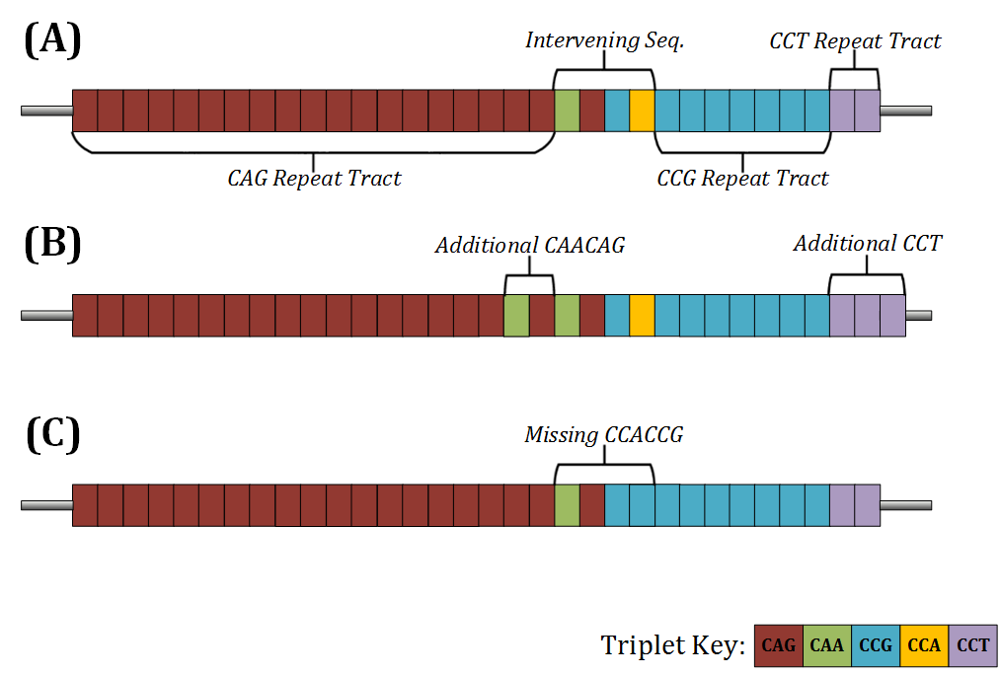
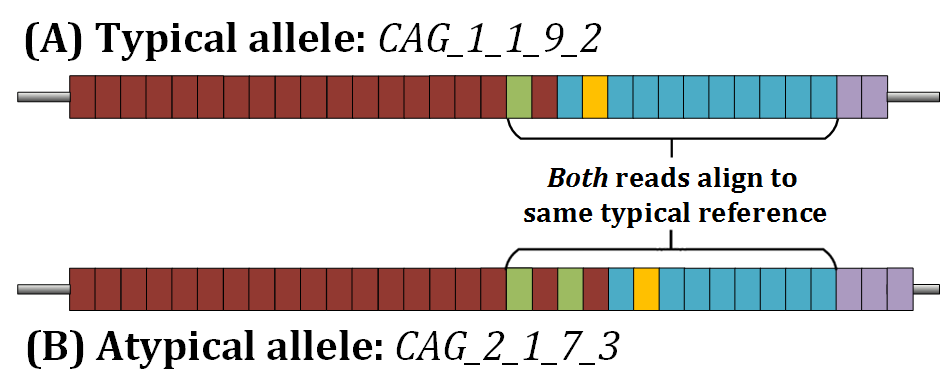

.. _sect_genotyping:

Automated Genotyping (Gtype)
================================

The genotyping procedure of ScaleHD has three stages. The results from each stage are utilised in step with one another to act as a double-confirmation of the data. The first stage involves Digital Signal Processing (DSP). This stage's main function is to determine the structure of the Huntington Disease repeat tracts. As seen in the figure below, a typical structure consists of a CAG tract, an intervening sequence, a CCG tract and a CCT tract. In 95% of samples, the structure of the intervening sequence is one CAACAG hexamer, and one CCGCCA hexamer. This 'typical' structure is represented as: CAG_1_1_CCG_CCT. Example allele structures can be seen below.

``A) A standard *HTT* sample structure, nominally described as 'typical'.``
``B) An example of a common atypical structure with an additional CAACAG in the intervening sequence.``
``C) A futher example of a common atypical structure, with a missing CCGCCA``

However, in ~5% of samples, the structure differs. These 'atypical' samples, have an intervening sequence which is different from the normally observed one. These can vary in literal size, but an example of one atypical allele would be represented as: CAG_2_1_CCG_CCT. This is important as, due to the string-similarity of the hexamers in the intervening sequence, an atypical allele can be incorrectly assigned to a typical reference with a larger CCG. For example, a sample with the genotype CAG_2_1_7_CCT (A) would be the exact same length as CAG_1_1_9_CCT (B):

Thus, the DSP module will scan each read in an aligned assembly (aligned to a typically structured reference). This scanning is done to determine the literal structure of repeat units present, and if any alleles are atypical in nature. This is important as changes to the genotype may contain relevant clinical implications. Existing generic microsatellite genotyping software does not take this specific Huntington Disease behaviour into account and will always provide an incorrect genotype, a problem that ScaleHD solves.

For each tract in *HTT* data (CAG, CCG, CCT), masks of every possible string rotation (e.g. CAG -> AGC -> GCA) are read across each read, in a sliding window. This is done, as not every read in an assembly will be the exact same length and may not start at the exact same position -- this results occasionally in certain repeat tracts 'starting' on an offset base position, by one or two bases. In order to successfully identify *all* repeat tracts in *all* reads, these rotations are required. This mechanism produces a 'staggered assembly', which can be seen in the figure below.

.. image:: img/dsp-staggering.png

Once we have identified where each repeat tract lies within a read, we can easily derive the literal string value of the intervening sequence -- the information between the end of the CAG tract and the start of the CCG tract. However, with absurdly low rates, we have observed novel insertion mutations within the actual intervening sequence itself. As a result, the DSP module was extended to then scan the intervening sequence itself instead of naïvely extracting information in a position-based way.

With this information now curated, we create allele objects. Instances of this class contain relevant information *per allele*, which is useful to us in the case of samples where one allele is typical and one allele is atypical -- despite being from the same sample, these alleles will have utilised different reference libraries, will have different assemblies, and so on. These attributes are assigned to each allele. We must then sort these alleles down to just two valid alleles, due to the diploid nature of the data. 

We do this with the second genotyping stage, a heuristically driven filter model, which takes in characteristics of available data from allele objects to determine which two allele objects are valid choices. We sort objects by total number of aligned reads -- the top allele is always taken as a 'primary' allele (parenthesis used as it may not be the biological primary allele.. just the allele we primarily chose from the assembly). Then we use weighted evidence from the remaining allele objects to determine which is valid; for example, relative read count in relation to CAG size, CAG size in comparison to the primary allele, CCG differences if CAG values are close, and so on.

Once filtered, we then pass to the final stage, genotype confirmation via Density Estimation and First Order Differentials. For each allele object, we observe the CAG distribution for each CCG value determined by DSP: that is, from the read counts against a forward-aligned 4000 reference library, we take the 200 values specific to the current CCG. In this sub-distribution, we then use density estimation to confirm if a peak is present at our suspect location. That is, from the CAG value derived from DSP, we observe if the number of aligned reads at that position is appropriately different from the rest of the distribution. If so, we then use first order differentials (n-(n-1), across the whole distribution) to observe the largest change in aligned reads -- a peak -- an allele.

After this, graphs are rendered, results are written to output, and whatever else.