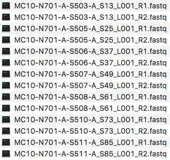

.. _sect_dataassume:

Data Assumptions
================================

ScaleHD makes a few assumptions about the input data which you provide it. Details about those assumptions can be found in this section, to aid the user in preparing their input into an appropriate format for ScaleHD to process it successfully.

File Input
~~~~~~~~~~~

ScaleHD utilises both forward and reverse reads from amplicon sequencing in order to genotype a sample effectively. In order to determine whether an individual file is a sample's forward or reverse data, ScaleHD looks for the substring "_R1" (forward) and "_R2" (reverse) at the end of each file name. Thus, user input should follow this behaviour within the specified input folder.

In addition to the file name, ScaleHD expects any input folder to contain an even number of files, and only sequence input data (either *.fastq.gz, or unzipped) within said input folder. To be verbose, valid input file extensions are as follows:

 * sample_name.fastq.gz
 * sample_name.fq.gz
 * sample_name.fastq
 * sample_name.fq

No other files will be considered valid. If there is a non-even number of input files present (i.e. not every sample has two files, R1 and R2), ScaleHD will not run.

Reference Libraries
~~~~~~~~~~~~~~~~~~~

Due to the multiple reference design approach to determining legitimate alleles that ScaleHD uses, the pipeline expects an input reference library to conform to a certain standard.

.. _forward-reference:
For the *forward* reference library, there must be a total dimensional value of 4000 references within the library; CAG1-200 with CCG1-20. Each individual reference sequence label must also conform to a naming standard. For example, a reference sequence of CAG 17, CCG 6, must be labelled as:

::

  >17_1_1_6_2
  GCGACCCTGGAAAAGCTGATGAAGGCCTTCGAGTCCCTCAAGTCCTTCCAGCAGCAGCAGCAGCAGCAGCAGCAGCAGCAGCAGCAGCAGCAGCAGCAGCAACAGCCGCCACCGCCGCCGCCGCCGCCGCCTCCTCAGCTTCCTCAGCCGCCGCCGCAGGCACAGCCGCTGCT

.. _reverse-reference:
For the *reverse* reference library, we utilise a static 100CAG with varying CCG1-20. This is as we only utilise the reverse reads to determine CCG values and resultant zygosity. An example of an individual reverse reference is:

::

  >100_1_1_15_2
  CAGCAGCAG... <sequence continues>

Basically, the only thing that is able to be altered about a user's input reference library is the forward and reverse flanks of the sequence. This is an intentional design decision, and ScaleHD will not function properly with alternatively styled reference libraries. Please see my other software, RefGeneratr, at https://github.com/helloabunai/RefGeneratr. This package allows for generating custom reference libraries with ease, and is actually installed as a dependency for ScaleHD.

An example of valid reference libraries can be seen on ScaleHD's github page, under /src/ScaleHD/config/4k-HD-INTER.fas and /src/ScaleHD/config/20TypicalReverse.fasta. Valid file extensions are:

 * reference_name.fasta
 * reference_name.fas
 * reference_name.fa