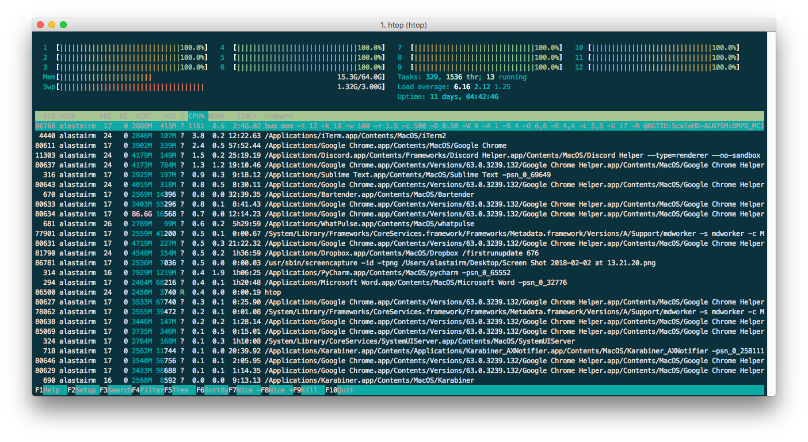

.. _sect_reqhard:

Hardware requirements/recommendations
================================

ScaleHD uses technologies such as Sequence Alignment to automatically genotype HD samples. Such processes can be quite intensive on your computer, but hardware requirements are not extraordinary for any software in the same field.

The pipeline has been developed on a Late 2013 Mac Pro, which has the following hardware:

 * 3.5 GHz 6 Core, 12 Thread Intel Xeon E5
 * 64 GB 1866 MHz DDR3 RAM
 * 1TB PCI-E Solid State Drive
 * AMD FirePro D500

However, you do not necessarily require the same specification of computer to successfully run ScaleHD. The amount of CPU threads and system RAM you have installed will improve the performance of sequence alignment, but the rest of the pipeline is generally not demanding, in terms of performance. Developed features, such as Digital Signal Processing, require a non-insignificant amount of processing cycles; this is due to the single-threaded nature of Python more than any hardware bottlenecks. There is a planned re-write of the Digital Signal Processing module in a compiled language (instead of an interpreted one), in the future.

Minimum specifications
~~~~~~~~~~~~~~~~~~~~~~

Some 'minimum specifications' for a satisfactory level of performance should be understood as (roughly) follows:

 * A modern Intel (2013 onwards) or AMD Ryzen (2017 onwards) chipset, with a minimum of 4 threads (the more, the better).
 * An absolute minimum of 16GB DDR3 RAM, but ideally more.
 * A large amount of data storage (>500GB free).

For an example of ScaleHD's genotyping performance on my development machine, here is a description of ScaleHD running on a cohort of 408 illumina miseq samples:

 * 816 input files, totalling 15GB
 * Utilising all 12 threads
 * Maximum RAM usage at 
 * A total processing time of 27 hours
 * An average sample processing time of 7 minutes
 * The longest sample processing time being 13 minutes
 * An output folder totalling 14.8GB

And a snapshot of the resources utilised by the most intensive module of ScaleHD, the sequence alignment wrapper:

Hopefully this information gives you enough of an idea to plan your sequence run with ScaleHD.