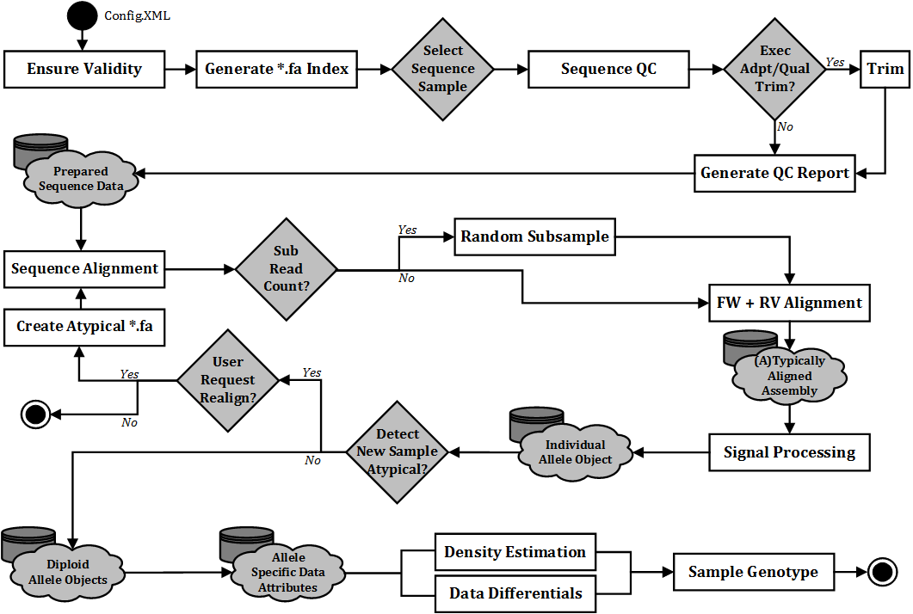

.. _sect_overview:

Overview
================================

As mentioned in the Index of this documentation, ScaleHD is a bioinformatics pipeline for use in broad-scope automated genotyping of Huntington Disease (HD) data. The pipeline is made up of four main stages: Sequence Quality Control (SeqQC), Sequence Alignment (SeqALN) and Automated Genotyping (GType). Once a stage has completed, as per user instructions, required information is automatically passed to the next stage (..a pipeline..).

It is designed with UNIX systems in mind, so there is unfortunately no Windows support. Why would you do research on Windows, anyway? For more details about hardware requirements, please see :ref:`sect_reqhard`.

A broad overview of the pipeline stages can be viewed here:

ScaleHD-ALSPAC
================================

There is a fork of ScaleHD, entitled ScaleHD-ALSPAC. The main functionality of this version is identical to "vanilla" ScaleHD, but differs in one key aspect.
For the Avon Longitudinal Study of Parents and Children (http://www.bristol.ac.uk/alspac/), analysis of HTT data requires us to not know whether an individual has
a CAG repeat size of over 31. As a genotyping platform, ScaleHD will expose this information multiple times throughout processing.
Thus, this branch of ScaleHD will mask allele sizes from the end user, throughout intermediate files and processing stages, and the end genotype results.

If you don't have a need for this functionality, don't use this version of the application.

Due to the requirements of masking alleles, certain third party software output has to be culled in order to maintain this behaviour:

Quality Control
----

In the SeqQC stage of ScaleHD-ALSPAC, we are unable to produce a copy of cutadapt trimming reports as output for each sample.
We continue to check the output of cutadapt, for warnings or error messages that would need to be passed on to the end user. However, this is done entirely in-memory.

FastQC would also compromise allele masking, and there is no realistic way to alter the output of this software. So, byebye FastQC (utilisation culled).

Sequence Alignment
----

todo! lmaoOOo

Genotyping & SNP Calling
----

todo! lmaoOOo