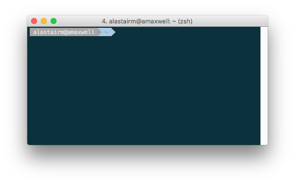
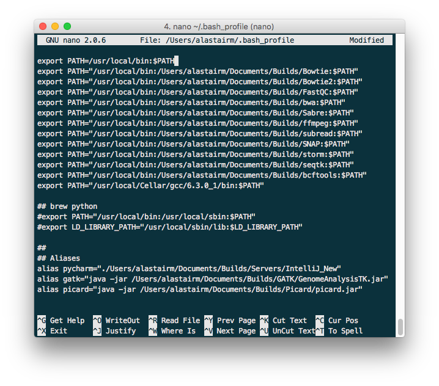

.. _sect_reqpack:

Software Dependencies
================================

ScaleHD functions entirely on open-source software, and itself is open-source. As ScaleHD is primarily a Python based package, certain Python libraries are required for it to work properly. These dependencies should be installed upon running the installer script, or when installing the package from PIP. However, if you are curious as to what packages are used (and which versions..) then you can find that information here.

Python Packages
~~~~~~~~~~~~~~~

All software packages have an accompanying version number listed. These are the versions of each package from which ScaleHD was developed. Newer versions may function fine, but are not tested. It is highly recommended to avoid older versions, and if possible, use the exact same version as during development. If you do not want to overwrite any packages of which you have a newer version, please see the sub-section in :ref:`detailed-install` about utilising virtual environments.

 * cutadapt (1.9.1)
 * django (1.5.4)
 * generatr (0.252)
 * lxml (4.0.0)
 * matplotlib (1.3.1)
 * numpy (1.13.1)
 * pandas (0.14.1)
 * peakutils (1.0.3)
 * prettyplotlib (0.1.7)
 * PyPDF2 (1.26.0)
 * pysam (0.9.1.4)
 * regex (2017.1.17)
 * reportlab (3.3.0)
 * rpy2 (2.8.3)
 * scipy (0.17.1)
 * sklearn (0.19.0)

Third Party Binaries
~~~~~~~~~~~~~~~~~~~~

ScaleHD also uses third party binaries to carry out certain functions. These binaries are expected to exist on your system $PATH variable, so they can be called by a UNIX subprocess without invoking a shell (as this is a huge security risk and generally bad design, and anyone who uses shells within a subprocess should feel bad about themselves). For more information on how to put binaries on your $PATH, please see the section :ref:`installation`. As the user can select which stages of ScaleHD to run, only the binaries utilised in each selected stage will be required. *However, for peace of mind it is recommended to just provide all required third party binaries on your $PATH anyway*. As with python dependencies, a software version is listed. Newer versions of dependencies may work with ScaleHD; using older versions is not recommended.

 * Java (1.8.0_20)
 * FastQC (0.9.2)
 * SeqTK (1.2-r101-dirty)
 * BWA-MEM (0.7.15-r1140)
 * Samtools (1.3.1)
 * R (3.3.2)
 * Picard (2.10.10)
 * GATK (3.8)

.. _installation:

Installation
============

As ScaleHD is a pipeline with a potentially varied userbase (in terms of background), certain users may need more instructions on how to get the software up and running. As such, the documentation for installation is split into two sub-sections. For users who are comfortable with UNIX systems, command line terminals and general package/dependency management, please read the section :ref:`quick-install`. For other users, who may never have used UNIX before, or are uncomfortable with command line interfaces, please see the :ref:`detailed-install`.

As I have developed the software on OS X, and most of the end-users in our lab will be running the pipeline on this operating system, instructions are tailored to it as a result. **However**, if you are using a GNU-UNIX type operating system (Ubuntu, for example), there will be notes on how to install ScaleHD for your OS, too. ScaleHD has been developed on OS X 10.11.6 and tested on OS 10.10-10.11.6, as well as Ubuntu 14.04 LTS.

.. _quick-install:

Quick Instructions 
~~~~~~~~~~~~~~~~~~

If you know your way around a terminal, these instructions are for you.

ScaleHD uses Python 2.7, so ensure your target for package installation is the correct version of Python on your system.

::

  pip install scalehd

This will install all python dependencies for you. Depending on your user privilege level, you may want to use sudo. For each third party binary, please compile the source to your systems specification, or use a pre-compiled binary provided by the developer. Add an entry to your $PATH for each of 'java', 'fastqc', 'seqtk', 'bwa', 'samtools', 'r' and aliases for 'picard' and 'gatk'. **These binaries must be as listed here, in lower case.** This pipeline has only been tested on bash and zsh, so other shells may exhibit unexpected behaviour(s). Once you have augmented your $PATH as above, you are good to go.

.. _detailed-install:

Detailed Instructions 
~~~~~~~~~~~~~~~~~~~~~

If you're new to UNIX, bioinformatics, or command line interfaces in general, these instructions are for you. We will install ScaleHD from a completely clean install, step-by-step. This means, we assume your UNIX operating system has no dependencies installed at all, and requires everything installed from scratch. We assume absolutely zero knowledge of any techniques required to install and use ScaleHD, so it will be very in-depth. Let's begin!

Before we install anything related to ScaleHD, it is worth mentioning that if you are also working on OS X, you will be required to install command line tools to make the remaining installation procedure possible. To do this, open a terminal. Press ⌘+Space to open spotlight search, and type "Terminal". In this prompt, type the command:

::

  xcode-select --install

A GUI prompt will appear; press 'Install'. This will download a ~130MB package and install it for you. You need not do this on Ubuntu as Canonical have the sense to include a C++ compiler and package manager with their operating system, whereas Apple do not.

The next step is to install PIP. PIP is a Python package manager, which allows you to install software from the Python package index, over the internet, without being required to get dependencies manually. Your computer system may already have PIP installed, but incase it doesn't, we will install it here. You need to download the Python script get-pip.py from https://bootstrap.pypa.io/get-pip.py. Once you have this downloaded, we need to run it to install PIP.

The next step is to run the script. Go back to your terminal which you opened previously, and prepare to enter a new command.

.. warning::
    PIP requires Python to function. If you are working on OS X or any modern version of Ubuntu, you already have Python 2.7 installed, and do not need to do anything else. If you lack access to Python 2.7, contact your system administrator to get it installed, or see https://www.python.org/downloads/release/python-2713/.

.. note::
    Throughout these instructions, we will refer to a "builds" directory, where we will be installing third-party binaries. In our examples, we have used the folder path '/Users/alastairm/Documents/Builds', wherein will be subfolders for each binary. How you allocate your binaries is up to you, but this tutorial will follow this builds directory format.

Now we run our downloaded script to install PIP. Assuming that your script is in your user Downloads folder (/Users/user-name-here/Downloads/), we will execute the following command:

::

  python ~/Downloads/get-pip.py

The specific command you need to run will depend on the location that you chose to download get-pip.py. Regardless, This will install PIP onto your system, allowing you to install ScaleHD and any Python-based dependencies with no effort at all. In order to do that, in the same terminal, issue a new command:

::

  pip install scalehd

This will install all python dependencies for you. Depending on your user privilege level, you may want to prefix the above command with 'sudo', which will run the command at an administrator level. If you are unsure, talk to your system administrator. Now that ScaleHD and its dependencies have been installed, we need to install the required third-party binaries which are not available for installation from PIP.

.. warning::
    For all the following third-party binaries, ScaleHD attempts to detect binaries with a lower case filename. If your binary files are called something else, ScaleHD will be unable to locate them on your $PATH. Please ensure that your binaries are all respectively named 'fastqc', 'seqtk', 'bwa', 'samtools' and 'r'. ScaleHD also requires aliases for 'picard' and 'gatk', which we will cover in their respective sub-sections.

Java (1.8.0_20)
~~~~~~~~~~~~~~~

Java is required for certain packages to run, but is normally distributed as part of any UNIX based operating system and should already be installed on your system. To check, open a terminal and type the command:

::

  java -version

This will return a string, telling you which version of Java is installed (if any). ScaleHD has been developed with 1.8.0_20 installed, but any 1.8 version of Java should function the same. If you do not have Java installed, please install the Java Development Kit **and** the Java Runtime Environment for your system. See http://www.oracle.com/technetwork/java/javase/downloads/jdk8-downloads-2133151.html and http://www.oracle.com/technetwork/java/javase/downloads/jre8-downloads-2133155.html for more information.

FastQC (0.9.2)
~~~~~~~~~~~~~~

.. _install-fastqc:

    FastQC is a bioinformatic tool which generates visual reports on the quality of a particular input sequence data from NGS platforms. It is available as a GUI (graphical user interface) based program, but we need to acquire a version which runs as a command line tool so that ScaleHD can run it in a pipeline. To do this, please download FastQC from https://www.bioinformatics.babraham.ac.uk/projects/download.html#fastqc. Regardless if you are using OS X or Ubuntu, please download the Win/Linux zip file. Extract this zip, then locate the binary titled "fastqc". Copy this binary file to your Builds folder, then open a terminal.

.. note::
    We will now add FastQC to our $PATH. By default, OS X and Ubuntu will be using the BASH environment, so these instructions are for BASH. If you are using an alternative shell, you are advanced enough to know how to add things to your $PATH already and shouldn't really be reading this.

We are going to edit a text file in our terminal. Here, the program 'nano' is used, but you can use whichever editor you prefer.

::

  nano ~/.bash_profile

This will open a screen, similar to this (but your file will be blank):

Adding things to your $PATH is as simple as typing the following:

::

  export PATH="/usr/local/bin:/path/to/your/binary/file:$PATH"

for each binary. In our example case of the Builds directory, and for FastQC, we would thus type:

::

  export PATH="/usr/local/bin:/Users/alastairm/Documents/Builds/FastQC:$PATH"

And now, FastQC is on our system's $PATH, and can be called/executed from any location in the shell. However, before we do that, you need to 'apply' the changes. This is done by sourcing your bash_profile file:

::

  source ~/.bash_profile

Alternatively, you can restart your terminal application, or log out and log in.

SeqTK (1.2-r101-dirty)
~~~~~~~~~~~~~~~~~~~~~~

As the methodology for adding binaries to your path has been covered in :ref:`install-fastqc`, we will not cover it again for every single binary. SeqTK is available at https://github.com/lh3/seqtk, where you will also find instructions on how to compile the application for your system. Once compiled, move the binary to your Builds folder, and add that directory to your $PATH.

BWA-MEM (0.7.15-r1140)
~~~~~~~~~~~~~~~~~~~~~~

Burrows-Wheeler Aligner is available from http://bio-bwa.sourceforge.net/. Extract the downloaded tarball, then move into that directory:

::

  tar -zxvf ~/Downloads/bwa-whatever.tar.bz2
  cd ~/Downloads/bwa-whatever/

Inside this directory, we will compile the source code into the binary executable:

::

  ./configure
  make
  make install

This is the standard trio of commands to configure a source for your system, make the binary, and install the binary. A file, 'bwa', will appear in the current directory after successful compilation. Move this binary to your Builds folder, and add that directory to your $PATH.

Samtools (1.3.1)
~~~~~~~~~~~~~~~~

Samtools is available from http://samtools.sourceforge.net/. Installation is identical to that of BWA-MEM. Extract the downloaded tarball, and move into the newly extracted directory. Configure, make and make install. Copy the new samtools binary to your Builds directory, and add it to your $PATH.

R (3.3.2)
~~~~~~~~~

R is a statistical scripting environment with a powerful array of analysis packages. ScaleHD uses it for bayesian algorithms. R is available at https://cran.rstudio.com/bin/macosx/ and comes with a GUI-based installer, so no further instructions should be required. It is automatically put onto your $PATH, for you.

Picard (2.10.10)
~~~~~~~~~~~~~~~~

Picard is not a UNIX binary, and as such we need to do something slightly different to enable it for ScaleHD. Download the JAR release of Picard from https://broadinstitute.github.io/picard/. A JAR file is a package containing all code/images/resources into one file for distribution -- it's a java executable, essentially. Since we cannot add a JAR to our $PATH, we need to make an alias. In our bash_profile file, we add the following line:

::

  alias picard="java -jar /Users/alastairm/Documents/Builds/Picard/picard.jar"

This creates a custom command, 'picard', which runs the command seen above. This allows us to invoke the Java virtual machine to launch the Picard JAR file, from our shell. This allows ScaleHD to run Picard in a non-interactive manner.

GATK (3.8)
~~~~~~~~~~

GATK is also a Java archive, and not a UNIX binary. Download GATK from https://software.broadinstitute.org/gatk/download/ and copy it to your Builds directory. Add the following alias to your bash_profile:

::

  alias gatk="java -jar /Users/alastairm/Documents/Builds/GATK/GenomeAnalysisTK.jar"

Again, replacing the literal directory with your own Builds path. Once you've done this, you have successfully installed all required packages for ScaleHD to function!

Virtual Environments
~~~~~~~~~~~~~~~~~~~~

Virtual Environments allow a Python user to create a separate terminal environment, which is separate from the 'main' environment of the operating system, but acts in an identical manner. This allows you to create an environment for a specific purpose, e.g. installing specific versions of packages that you did not wish to overwrite in your 'main' environment. This is useful if you have certain Python packages installed for other projects, which require a different version than that of ScaleHD.

To read up on Virtual Environments, we recommend reading this tutorial: http://docs.python-guide.org/en/latest/dev/virtualenvs/.

Common Issues
~~~~~~~~~~~~~

When colleagues were testing the software, these were the most common issues encountered when installing and/or running ScaleHD. If you're having trouble installing ScaleHD, hopefully an answer to your issue will be here.

 * LibXML headers missing

For this issue, you are missing the libxml2-dev and libxslt-dev libraries from your system. These packages should be installed as part of lxml, which is included in the setup script for ScaleHD, and should have been installed automatically. However, you can check if you are missing this package by opening a terminal, launching the Python interpreter (run the command 'python'), and then trying the command 'import lxml'. If this fails, then you know the package did not install properly, for whatever reason. 

To remedy this, you can install lxml 'manually' from pip:

::

 STATIC_DEPS=true sudo pip install lxml

This command will require an internet connection, as it will download the sources for each developer library and build them for you, hopefully resolving any issues you have with lxml.

 * LibXML parsing error stack

As of the time of writing, there is no functionality within ScaleHD to check the structural integrity of your XML configuration files used, outside of the validity of provided attribute flags. If you have malformed XML, such as misplaced tags, ScaleHD will not launch and you will be greeted with a debug stack from lxml failing to parse invalid XML. Please check your XML and try running ScaleHD again.

 * SciPy stack errors

Sometimes the SciPy stack installs incorrectly from PIP, or fails quietly (i.e. the install failed, but claimed it was successful). If this is the case for you, we recommend installing the SciPy stack at a user level.

::

  pip install --user numpy scipy cython matplotlib

If this still refuses to work, you can look into installing these dependencies via Homebrew (see: https://brew.sh/).

::

  brew tap homebrew/science && brew install python numpy scipy matplotlib

